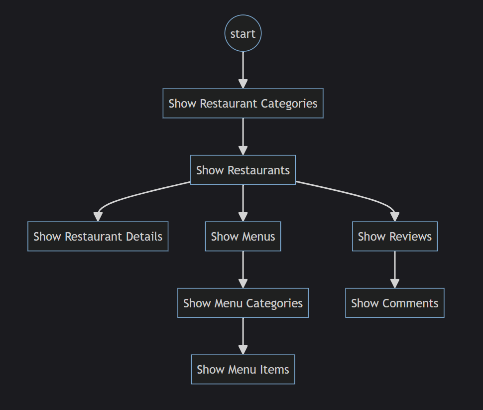
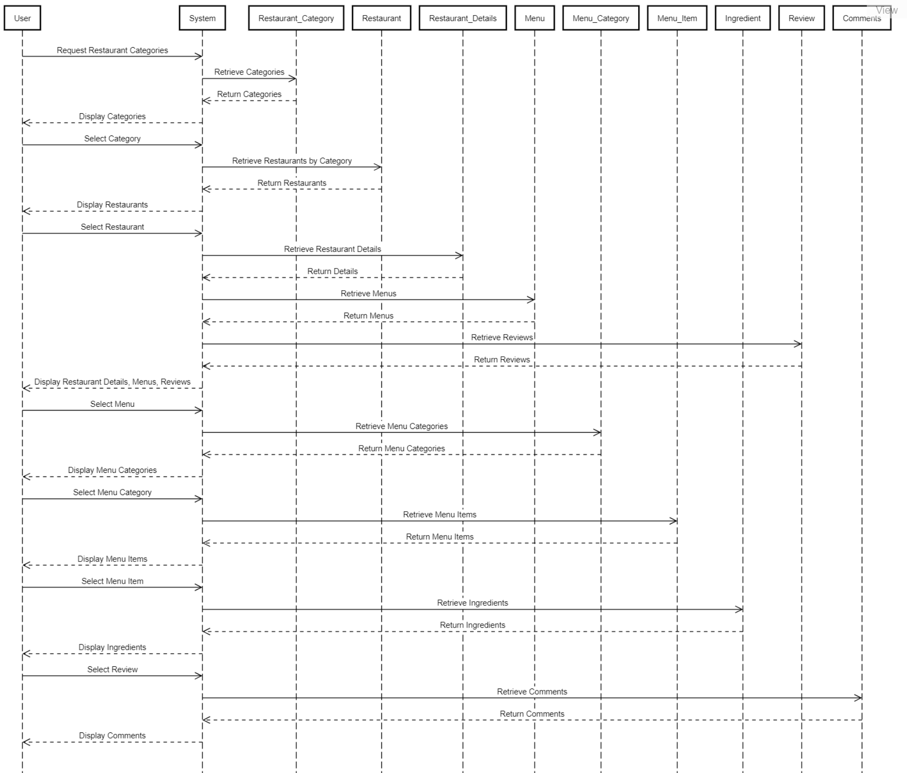

# USE CASE *Browse Restaurants & Menus*

### Flowchart

### Sequence diagram

### Pseudocode
    Function browseRestaurants():
    categories = getRestaurantCategories()
    display(categories)

    selectedCategory = getUserInput()
    restaurants = getRestaurantsByCategory(selectedCategory)
    display(restaurants)
    
    selectedRestaurant = getUserInput()
    restaurantDetails = getRestaurantDetails(selectedRestaurant)
    display(restaurantDetails)
    
    menus = getMenus(selectedRestaurant)
    display(menus)
    
    reviews = getReviews(selectedRestaurant)
    display(reviews)

    selectedMenu = getUserInput()
    menuCategories = getMenuCategories(selectedMenu)
    display(menuCategories)
    
    selectedMenuCategory = getUserInput()
    menuItems = getMenuItems(selectedMenuCategory)
    display(menuItems)
    
    selectedMenuItem = getUserInput()
    ingredients = getIngredients(selectedMenuItem)
    display(ingredients)
    
    selectedReview = getUserInput()
    comments = getComments(selectedReview)
    display(comments)

    Function display(data):
    print(data)
